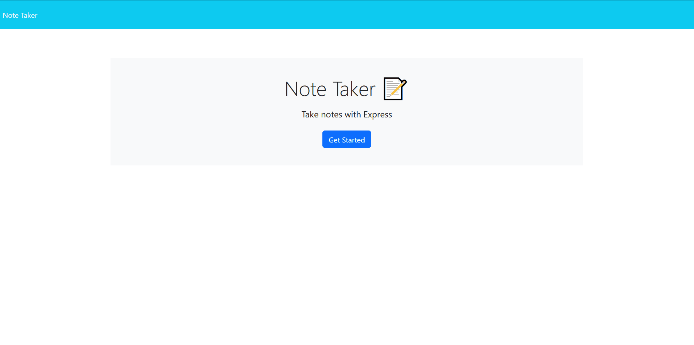

# Module 11: Express.JS Note Taker

## Description

This is a simple little app that lets you take notes, save them, and delete them. 



## Usage

Visit the site on Heroku: https://salty-coast-15089-8badcebed83c.herokuapp.com/

## Technologies Used
- HTML
- CSS
- JavaScript
- Node.js
- Express.js
- uuid.js

## Lessons Learned
- Even if something comes with  into node.js, it often still needs to be imported to be used (path, fs, etc)
- npm modules all have their own formatting and function parameters. Skimming over the documentation can lead to very confusing errors, like ```SyntaxError: Unexpected token t in JSON at position 3``` because your readFile callback function takes (err, data) as parameters, not just (data)

## Acknowledgements
- Starter code obtained from https://github.com/coding-boot-camp/miniature-eureka